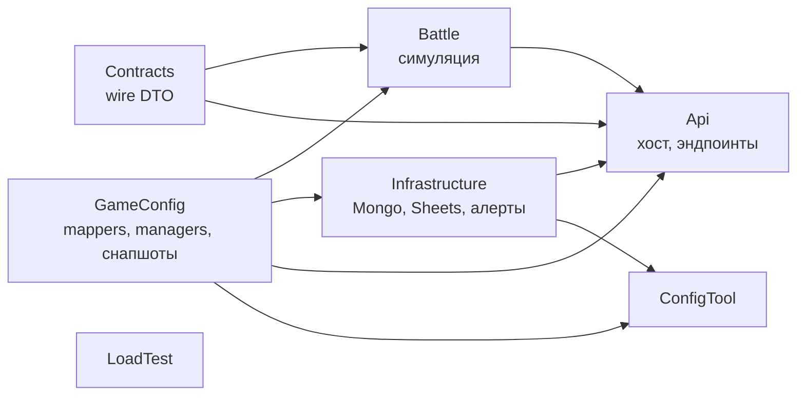
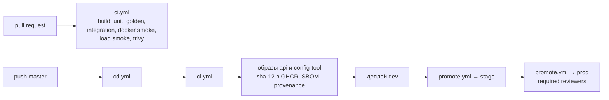

[Back to Documents](../README.md)

# Архитектура сервера

Один deployable сервис (модульный монолит), разнесённый на проекты так, чтобы компилятор держал границы слоёв. Механики боя и wire-контракт не зависят от ASP.NET, Mongo и Google.

## Проекты и зависимости



| Проект | Можно | Нельзя |
| --- | --- | --- |
| `Contracts` | DTO и enum'ы протокола | зависимости на другие проекты |
| `GameConfig` | парсинг строк листов, managers, `ConfigDistributor`, снапшоты и их сборка | ASP.NET, Mongo, Google API |
| `Battle` | симуляция поверх `IConfigDistributor` | ASP.NET, Mongo, Google API, HTTP |
| `Infrastructure` | Mongo, импорт Google Sheets, отправка алертов | эндпоинты, логика боя |
| `Api` | композиция DI, Kestrel, middleware, эндпоинты, health, метрики | игровая логика |
| `LoadTest` | только HTTP к запущенному серверу | ссылки на проекты сервера |

`internal` сохраняется, доступ между проектами и тестами — через `InternalsVisibleTo`. Namespace исторический: `Server.*`.

## Запрос боя

```text
POST /api/battle/replay
  → ForwardedHeaders → ExceptionHandler → CorrelationId → HttpLogging
  → Routing → OpsPortGuard → RateLimiter → Authentication → Authorization
  → BattleMetricsFilter → GameConfigReadyFilter (503 если конфиги не загружены)
  → scope: IConfigDistributor = IGameConfigSetProvider.Current.Distributor
  → BattleSimulatorService (scoped граф, свой RNG)
  → Newtonsoft JSON ответ
```

Сервисы боя регистрируются scoped (`BattleServicesRegistrar`), `ValidateScopes` и `ValidateOnBuild` включены. Каждый запрос получает свой граф и фиксированную версию конфигов на всё время боя: подмена конфигов посередине боя его не затрагивает.

## Конфиги

Подробно: [config-sync](../server/config-sync.md). Коротко:

- `GameConfigSnapshot` — сырые строки всех листов + версия sha256.
- `GameConfigSetBuilder` строит на версию новый `ConfigDistributor` теми же парсерами и managers, что были до рефакторинга.
- `GameConfigSetProvider` меняет текущий набор атомарно (`Interlocked.Exchange`).
- Mongo хранит снапшоты и историю активаций; активация идёт в транзакции и только после успешной сборки.

## Порты и доступ

| Порт | Что слушает | Защита |
| --- | --- | --- |
| public `5000` | бой, `/api/config/*`, Swagger (Local/dev) | rate limit, лимит тела, `X-Config-Key` для публикации |
| ops `9090` | `/health*`, `/admin/config/*` | `OpsPortGuardMiddleware` по `Connection.LocalPort`, `X-Admin-Key`, на VPS только `127.0.0.1` |

Ключи сравниваются через `CryptographicOperations.FixedTimeEquals`. За Caddy включается `ForwardedHeaders` с доверенными сетями из `ReverseProxy:KnownNetworks`, чтобы rate limit считал реальный IP клиента.

## Окружения

| | Local | Development | Staging | Production | Testing |
| --- | --- | --- | --- | --- | --- |
| Хост | машина разработчика | VPS 1 | VPS 1 | VPS 2 | CI |
| Bind | Loopback | Any в контейнере | Any в контейнере | Any в контейнере | тестовый сервер |
| Swagger | да | да | нет | нет | нет |
| Конфиги | Sheets / файл / Mongo | Mongo, bootstrap из Sheets, poll | Mongo, bootstrap из Sheets, poll | Mongo, без Google, manual reload | файл |
| Публикация из таблицы | да | да | да | нет | нет |
| Rate limit | выкл | вкл | вкл | вкл | выкл |
| Алерты Discord | выкл | вкл | вкл | вкл | выкл |
| Логи | simple | JSON | JSON | JSON | JSON |

Базовые значения — `appsettings.json`, отличия — `appsettings.<Environment>.json`, секреты — переменные окружения из `.env` на хосте. Все ключи: [runbooks/configuration.md](../runbooks/configuration.md). При старте `DangerousConfigurationReporter` пишет warning на опасные сочетания (Swagger вне Local и Development, Local слушает все интерфейсы вне контейнера); остальные ошибки конфигурации ловят валидаторы options и роняют старт.

## Наблюдаемость

- Логи: `Microsoft.Extensions.Logging`, JSON-консоль вне Local, correlation id (`X-Correlation-Id`) в scope каждого запроса, http logging метода, пути, статуса и длительности.
- Health: `/health/live` (процесс жив, используется Docker HEALTHCHECK через `--health-probe`), `/health/ready` (конфиги загружены, Mongo отвечает), `/health` (полный отчёт). Ответ JSON: `ok`, `warn`, `critical`; при `critical` код 503.
- Алерты: `IAlertPublisher` → ограниченная очередь (`DropOldest`) → `AlertDispatcher` → троттлинг по ключу (`CooldownSeconds`) → Discord webhook. Источники: смена health-состояния (только переходы), необработанные исключения (ключ `exception:<тип>:<путь>`), старт сервера, активация конфигов. При остановке очередь дочитывается до 5 секунд.
- Метрики: `Meter` `Lewdventure.Server` — счётчик `lewdventure.battles` и гистограмма `lewdventure.battle.duration` с тегами `kind` и `status`. Экспорта пока нет, снимаются через `dotnet-counters`.
- Остановка: `HostOptions.ShutdownTimeout = Server:ShutdownTimeoutSeconds`, `stop_grace_period` в compose больше таймаута.

## Сборка и поставка



Подробно: [runbooks/deploy-and-rollback.md](../runbooks/deploy-and-rollback.md).

## См. также

- [mongo-conventions.md](mongo-conventions.md)
- [.ai-factory/ARCHITECTURE.md](../../.ai-factory/ARCHITECTURE.md) — правила слоёв и анти-паттерны боя
