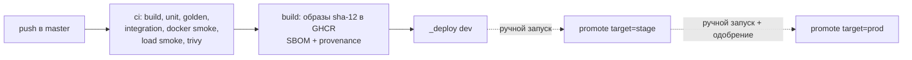

[← Runbooks](README.md)

# Деплой и откат

## Схема



Один и тот же образ (`ghcr.io/abromus/lewdventure-server:sha-<12 символов коммита>` и `lewdventure-config-tool` с тем же тегом) проходит dev → stage → prod. Пересборки при продвижении нет.

## Workflows

| Workflow | Запуск | Что делает |
| --- | --- | --- |
| `ci.yml` | pull request, вызывается из `cd.yml` | сборка в `--locked-mode`, unit и golden, интеграционные тесты Mongo, docker compose smoke с replay против эталона, нагрузочный smoke 15 с без ошибок, Trivy |
| `cd.yml` | push в `master`, вручную | CI → сборка и push образов → деплой dev |
| `promote.yml` | вручную: `target` (`stage`/`prod`), `image_tag` (необязательно) | берёт тег, который сейчас работает в предыдущем окружении (dev для stage, stage для prod), или указанный, проверяет, что он успешно деплоился туда, и деплоит в `target` |
| `rollback.yml` | вручную: `environment`, `image_tag` (необязательно) | без тега — откат на предыдущий успешный тег окружения; с тегом — деплой этого тега |
| `config-promote.yml` | вручную: `version` (`active` или `sha256:…`), `reason` | перенос снапшота конфигов stage → prod, см. [config-publish.md](config-publish.md) |
| `_deploy.yml` | вызывается из остальных | проверка образов в GHCR, выгрузка `deploy/` из коммита образа на VPS, `docker login`, `deploy.sh`, проверка `/health/ready`, при провале readiness — автоматический откат, итог в summary и Discord |

Деплой в одно окружение сериализован (`concurrency: deploy-<env>`), параллельные запуски ждут очереди.

## Что происходит на VPS

`scripts/deploy.sh <env> <tag>`:

1. Проверяет `.env`, создаёт сеть `lewdventure-edge`, если её нет.
2. `docker compose pull api config-tool` для тега.
3. `docker compose up -d --wait api` (ждёт HEALTHCHECK `/health/live` до 180 с; Mongo и `mongo-init` поднимаются как зависимости).
4. Успех → строка `ok` в `deploy-history.log`, чистка старых образов.
5. Провал → строка `failed`, последние 200 строк логов api, возврат предыдущего успешного тега. Код выхода `1` — предыдущая версия восстановлена, `3` — восстановить не удалось.

Затем workflow ждёт `/health/ready` (до ~60 с). Если готовности нет, запускается `deploy.sh <env> rollback`, и job падает.

## Ручные операции на VPS

```bash
cd /opt/lewdventure/stage
scripts/deploy.sh stage current
scripts/deploy.sh stage history
scripts/deploy.sh stage rollback
scripts/deploy.sh stage sha-0cc80fe1a2b3
scripts/collect-logs.sh stage 6h
cat deploy-history.log
```

`collect-logs.sh` собирает в архив `docker compose ps`, логи api и mongo за период, историю деплоев и `/health`.

Состояние стека:

```bash
docker compose --env-file compose/.env -p lewdventure-stage --project-directory compose \
  -f compose/compose.yaml -f compose/compose.vps.yaml -f compose/compose.stage.yaml ps
curl -s http://127.0.0.1:9092/health
```

## Откат

- Быстро: Actions → `rollback` → окружение, тег пустой. Возвращает предыдущий успешный тег. Повторный откат переключит обратно, потому что предыдущим станет откатанный тег.
- На конкретную версию: `rollback` с `image_tag=sha-…` (тег должен существовать в GHCR).
- Без GitHub: `scripts/deploy.sh <env> rollback` на VPS.

Откат образа не откатывает конфиги: активная версия снапшота в Mongo остаётся. Откат конфигов — активация прошлой версии, см. [config-publish.md](config-publish.md#откат-конфигов).

## Уведомления

При заданном `DISCORD_DEPLOY_WEBHOOK_URL` каждый деплой, откат и перенос конфигов пишет в Discord: окружение, статус, запрошенный и фактически работающий тег, ссылку на запуск. Сам сервер после старта отправляет «Server started» в канал алертов окружения (`Alerts__DiscordWebhookUrl`).

## Если что-то пошло не так

| Симптом | Что делать |
| --- | --- |
| `verify images` падает | тег не собран или нет прав `packages: read`; проверить Packages репозитория |
| `pull` на VPS: `denied` | обновить `GHCR_PULL_TOKEN` или сделать пакеты публичными |
| api не становится healthy | `scripts/collect-logs.sh <env> 1h`; частые причины — ошибки валидации options (пустой ключ, неверный webhook), нет конфигов на prod |
| readiness critical, live ok | `curl 127.0.0.1:<ops>/health`: `game-config` — нет активной версии или сборка упала; `mongo` — база недоступна |
| код выхода 3 | стек лежит; поднять вручную прошлый тег `scripts/deploy.sh <env> sha-…`, разобраться по логам |
